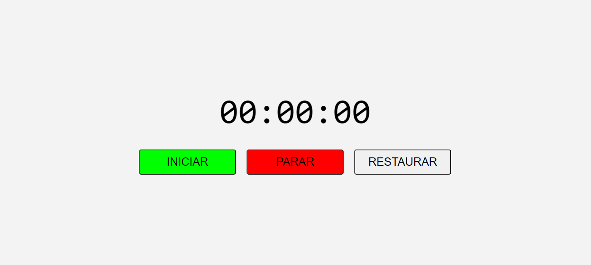

<h1 align="center">Dark Mode</h1>

## 📘 Sobre

**Cronômetro** criado utilizando a linguagem JavaScript, com o objetivo de aprimorar a habilidade em manipulação de data e hora.

## 🔨 Ferramentas

- HTML
- CSS
- JavaScript